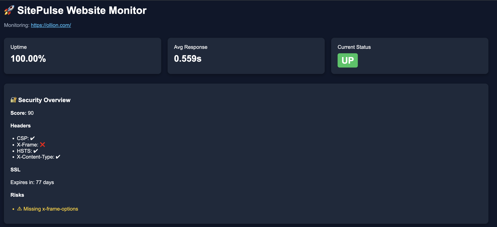
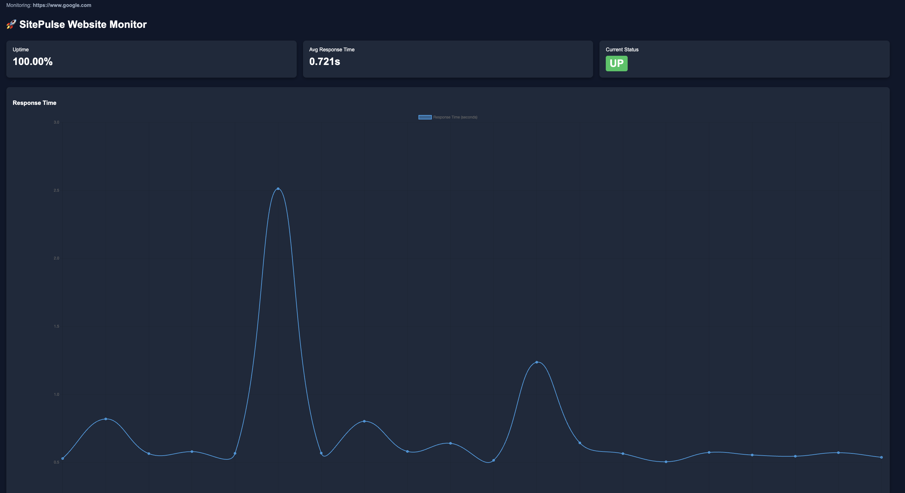
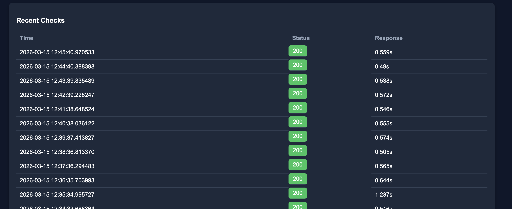

# 🚀 SitePulse Monitor

**SitePulse Monitor** is a lightweight, Dockerized **website uptime monitoring tool** built with **Python and Node.js**.
It continuously checks website availability, tracks response times, sends alerts on failures, provides a clean real-time dashboard, and performs basic security analysis including headers, SSL, and vulnerability scanning.

Perfect for **DevOps engineers, SREs, and developers** who want a simple self-hosted monitoring solution.

## Dashboard





---

## ✨ Features

✅ Website health checks every **60 seconds**
✅ **Response time tracking** and logging
✅ **Email alerts** after 3 consecutive failures
✅ **Real-time dashboard** with charts and metrics
✅ **Uptime percentage calculation**
✅ **Auto-refresh dashboard (30s)**
✅ **Docker deployment** for easy setup
✅ Lightweight and minimal dependencies

### 🔐 Security Scanning
✅ Security Headers Analysis
  - CSP
  - HSTS
  - X-Frame-Options
  - X-Content-Type-Options
✅  SSL Certificate Monitoring (expiry tracking)
✅  OWASP ZAP Baseline Scan (DAST)
✅  Security Score calculation
✅  Risk identification
---

## 🖥 Dashboard Preview

* 📈 Response time graph
* 📊 Uptime percentage
* ⚡ Average response time
* 🟢 Current status (UP / DOWN)
* 📜 Recent health checks table
* 🔐 **Security Overview Panel**

---

### 🔐 Security Overview Panel

* 🛡 Security score based on headers, SSL & vulnerabilities  
* 📑 Security headers check (CSP, HSTS, X-Frame, etc.)  
* 🔒 SSL certificate expiry tracking  
* 🚨 Vulnerability insights from OWASP ZAP  
* ⚠ Risk identification with warnings  

```
SitePulse Dashboard
---------------------------------

Uptime:           99.94%
Avg Response:     0.231s
Current Status:   UP

🔐 Security Overview
Score: 82

Headers:
CSP ✔
HSTS ✔
X-Frame ❌

SSL:
Expires in 25 days

Risks:
⚠ Missing X-Frame-Options
⚠ SSL expiring soon

Response Time Chart
-------------------

Recent Checks
Time                Status     Response
10:21:00            200        0.21s
10:20:00            200        0.24s
10:19:00            ERROR      0
```

---

# 🏗 Architecture

```
            +-----------------------+
            |     SitePulse         |
            |     Docker Container  |
            |-----------------------|
            | Python Monitor        |
            | - Website checks      |
            | - Response time logs  |
            | - Failure detection   |
            | - Email alerts        |
            | - Security Scanning   |
            |                       |
            | monitor.log           |
            | security.json         |
            |                       |
            | Node.js Dashboard     |
            | - Express server      |
            | - Chart.js graphs     |
            | - Uptime metrics      |
            +-----------+-----------+
                        |
                        |
                http://localhost:3000
```

---

# 📂 Project Structure

```
sitepulse-monitor
│
├── monitor
│   ├── monitor.py
│   ├── security_scan.py
│   ├── requirements.txt
│   └── fail_state.txt
│
├── dashboard
│   ├── server.js
│   ├── package.json
│   └── views
│       └── index.ejs
│
├── logs
│   └── monitor.log
│   └── security.json
│   └── zap_report.json
│
├── Dockerfile
├── start.sh
└── README.md
```

---

# ⚙️ Installation

### 1️⃣ Clone Repository

```bash
git clone https://github.com/YOUR_USERNAME/sitepulse-monitor.git
cd sitepulse-monitor
```

---

### 2️⃣ Build Docker Image

```bash
docker build -t sitepulse .
```

---

### 3️⃣ Run Container

```bash
docker run -d \
-p 3000:3000 \
-v /var/run/docker.sock:/var/run/docker.sock \
-e TARGET_URL=https://example.com \
-e ALERT_EMAIL=your@email.com \
-e ALERT_PASSWORD=your_email_app_password \
sitepulse
```

---

### 4️⃣ Open Dashboard

```
http://localhost:3000
```

---

# 🔧 Environment Variables

| Variable         | Description                   |
| ---------------- | ----------------------------- |
| `TARGET_URL`     | Website URL to monitor        |
| `ALERT_EMAIL`    | Email address used for alerts |
| `ALERT_PASSWORD` | Email app password for SMTP   |

---

# 📊 Metrics Tracked

SitePulse tracks:

* Website availability
* Response time
* Failure counts
* Uptime percentage
* Average latency

Logs are stored in:

```
/app/logs/monitor.log
```

Example:

```
2026-03-15 10:00:01,200,0.31
2026-03-15 10:01:01,200,0.28
2026-03-15 10:02:01,500,0.45
2026-03-15 10:03:01,ERROR,0
```

---

# 📧 Alerting

SitePulse sends an **email alert when the monitored website fails 3 consecutive checks**.

Alert example:

```
Subject: Website Monitor Alert

https://example.com is DOWN!
```

---

# 🐳 Docker Support

SitePulse is designed to run easily as a container.

Benefits:

* No local dependencies
* Easy deployment
* Portable monitoring tool
* Runs on any VPS

---
⚠️ Limitations

* ZAP scan requires Docker socket access
* Lightweight scanning (not full pentest)
* Single website monitoring (current version)
---

# 🚀 Future Improvements

Planned upgrades:

* Secure Docker Image
* Multi-website monitoring
* Slack / Telegram alerts
* Database storage (Postgres / SQLite)
* Kubernetes deployment
* Security trend analytics

---

# 🤝 Contributing

Contributions are welcome!

Steps:

1. Fork the repository
2. Create a feature branch
3. Submit a pull request


---

# ⭐ Support

If you find this project useful, please consider **starring the repository**.

It helps others discover the project!

---
